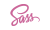
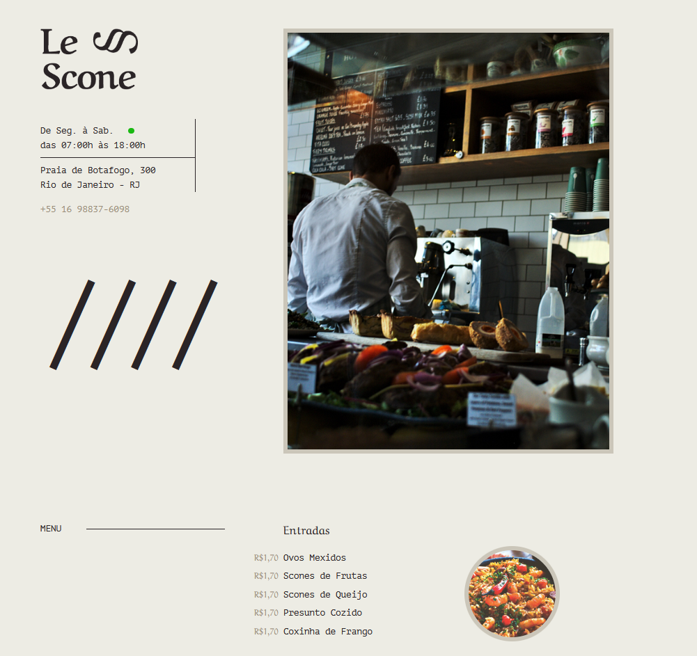

## 
Site feito com 

## 
Sobre o projeto

### 
O Le Scone, é um site feito para praticar o meu estudo de SASS no curso da Origamid (Prof André Rafael), onde eu aprendi a usar Mixins, Variáveis, Funções, Loops entre outras coisas no CSS, para deixá-lo ainda mais incrível!

## 
Tecnologias Utilizadas

- HTML5
- CSS3
- SASS

## 
Layout do Site

- <a href="https://site-sass-gabriel.netlify.app" target="_blank" style="font-size: 35px; text-decoration: underline; color: #eaeaea;">Acesse agora mesmo</a>

## 
Página principal   
